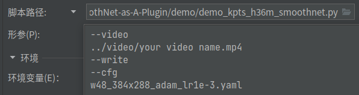

# Using SmoothNet As a HRNet Plugin

### 1. SmoothNet Result Example

<video id="video1" controls="" preload="none" poster="封面" height="150">
      <source id="mp4" src="https://github.com/ligaoqi2/Using-SmoothNet-As-HRNet-Plugin/assets/56901453/12ac771f-1b46-4e53-af34-dc445336fb8a" type="video/mp4">
</video>

### 2. HRNet Result Example

<video id="video2" controls="" preload="none" poster="封面" height="150">
      <source id="mp4" src="https://github.com/ligaoqi2/Using-SmoothNet-As-HRNet-Plugin/assets/56901453/4ef25179-7a37-4364-9a2e-4042de09ad4c" type="video/mp4">
</video>

## Introduction
This is a repo using SmoothNet as a HRNet Plugin to generate smooth pose trajectory from a single person motion video.

## Environment
The code is developed using python 3.9 on Ubuntu 18.04 and using an NVIDIA GeForce 3060 GPU.

## Quick start
### Installation
1. Create conda env
   ```
   conda create -n you-env-name python=3.9
   ```
2. Install [Pytorch](https://pytorch.org/get-started/locally/):
   ```
   pip install torch==1.11.0+cu113 torchvision==0.12.0+cu113 torchaudio==0.11.0 --extra-index-url https://download.pytorch.org/whl/cu113
   ```
3. Clone this repo, and we call the root directory as ${ROOT}.


4. Install dependencies:
   ```
   pip install -r requirements.txt
   ```
5. Install [COCOAPI](https://github.com/cocodataset/cocoapi):
   ```
   pip install pycocotools
   ```
6. Init video output dir:

   ```
   mkdir output
   cd output
   mkdir HRNet
   mkdir SmoothNet
   ```

   Your dir tree should look like this:

   ```
   ${ROOT}
   |-- data
   |-- experiments
   |-- lib
   |-- models
   |-- output
   |         |-- HRNet
   |         `-- SmoothNet
   |-- smoothnet
   |         |-- configs
   |         |-- data
   |         `-- lib
   |-- tools
   |-- video
   |-- README.md
   |-- requirements.txt
   ```

7. Download HRNet pretrained models from model zoo([GoogleDrive](https://drive.google.com/drive/folders/1hOTihvbyIxsm5ygDpbUuJ7O_tzv4oXjC?usp=sharing) or [OneDrive](https://1drv.ms/f/s!AhIXJn_J-blW231MH2krnmLq5kkQ))
   ```
   ${ROOT}
    `-- models
        `-- pytorch
            |-- pose_coco
            |   |-- pose_hrnet_w32_384x288.pth
            |   `--pose_hrnet_w48_384x288.pth
   ```

8. Download SmoothNet pretrained models from model zoo([Google Drive](https://drive.google.com/drive/folders/19Cu-_gqylFZAOTmHXzK52C80DKb0Tfx_?usp=sharing) or [Baidu Netdisk](https://pan.baidu.com/s/1J6EV4uwThcn-W_GNuc4ZPw?pwd=eb5x))
   ```
   ${ROOT}
    `-- smoothnet
        `-- data
            `-- checkpoints
                `-- h36m_fcn_3D
                     `--checkpoint_32.pth.tar
   ```   

### Run the Demo

1. Configure the python script to run and the runtime parameters in [Pycharm](https://www.jetbrains.com/pycharm/)





2. Get the result
```
${ROOT}/output/HRNet/*.mp4                  contains the result of HRNet
${ROOT}/output/SmoothNet/*.mp4        contains the result of SmoothNet
```

### Acknowledgments
```
@inproceedings{sun2019deep,
  title={Deep High-Resolution Representation Learning for Human Pose Estimation},
  author={Sun, Ke and Xiao, Bin and Liu, Dong and Wang, Jingdong},
  booktitle={CVPR},
  year={2019}
}

@inproceedings{xiao2018simple,
    author={Xiao, Bin and Wu, Haiping and Wei, Yichen},
    title={Simple Baselines for Human Pose Estimation and Tracking},
    booktitle = {European Conference on Computer Vision (ECCV)},
    year = {2018}
}

@article{WangSCJDZLMTWLX19,
  title={Deep High-Resolution Representation Learning for Visual Recognition},
  author={Jingdong Wang and Ke Sun and Tianheng Cheng and 
          Borui Jiang and Chaorui Deng and Yang Zhao and Dong Liu and Yadong Mu and 
          Mingkui Tan and Xinggang Wang and Wenyu Liu and Bin Xiao},
  journal   = {TPAMI}
  year={2019}
}

@inproceedings{zeng2022smoothnet,
      title={SmoothNet: A Plug-and-Play Network for Refining Human Poses in Videos},
      author={Zeng, Ailing and Yang, Lei and Ju, Xuan and Li, Jiefeng and Wang, Jianyi and Xu, Qiang},
      booktitle={European Conference on Computer Vision},
      year={2022},
      organization={Springer}
}

@article{liu2020a,
  title={A Graph Attention Spatio-temporal Convolutional Networks for 3D Human Pose Estimation in Video},
  author={Liu, Junfa and Rojas, Juan and Liang, Zhijun and Li, Yihui and Guan, Yisheng},
  journal={arXiv preprint arXiv:2003.14179},
  year={2020}
}
```

### Contact
```
ligaoqi02@gmail.com
```
